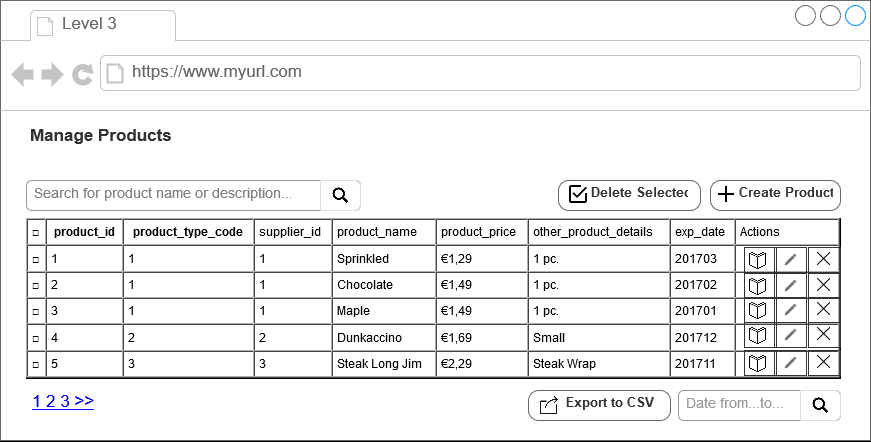

# MVC Example Level 3

* add the next element
* create the check(select)boxes
* create the export
* create the selected delete
* show a modal to confirm selected delete
* add a date column
* use a datepicker

