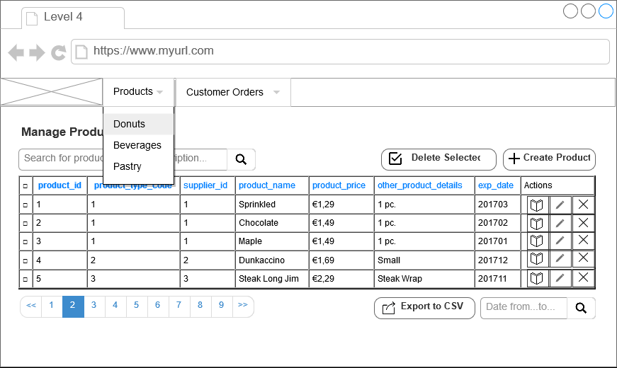

# MVC Example Level 4

* create the customer orders table
* create the customer orders views
* create a menubar
* add a logo
* add a products pulldown on product type
* add a orders pulldown on order status
* create a styled pagination bar
* add the orderby columns

